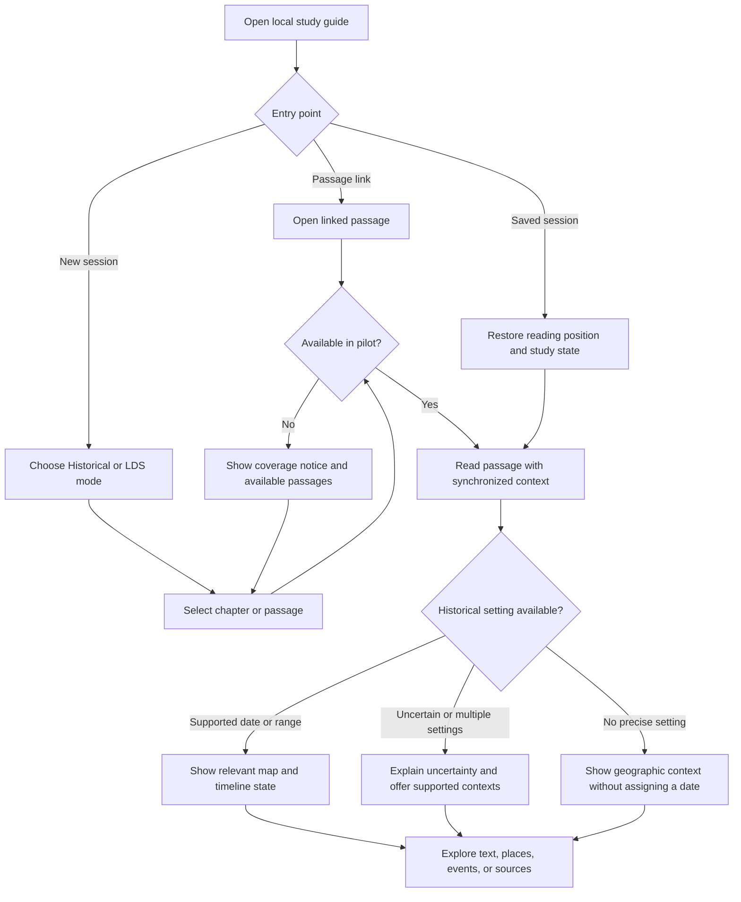
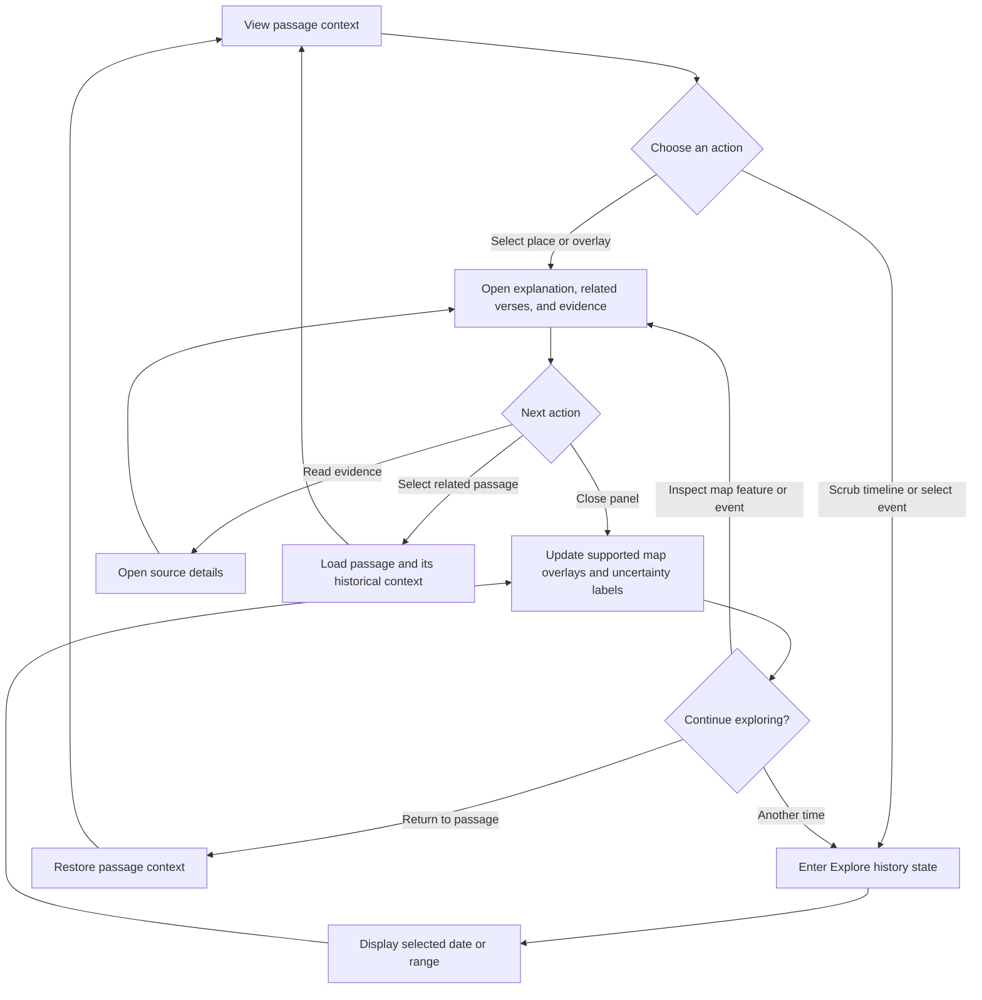
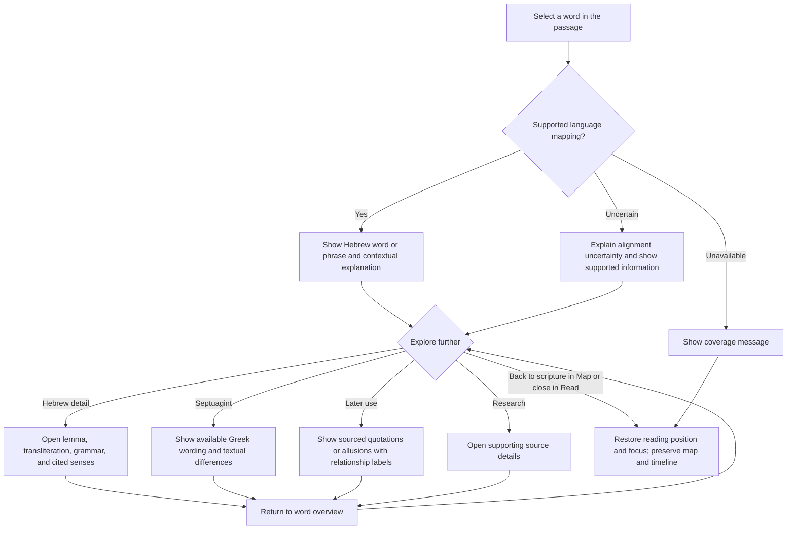
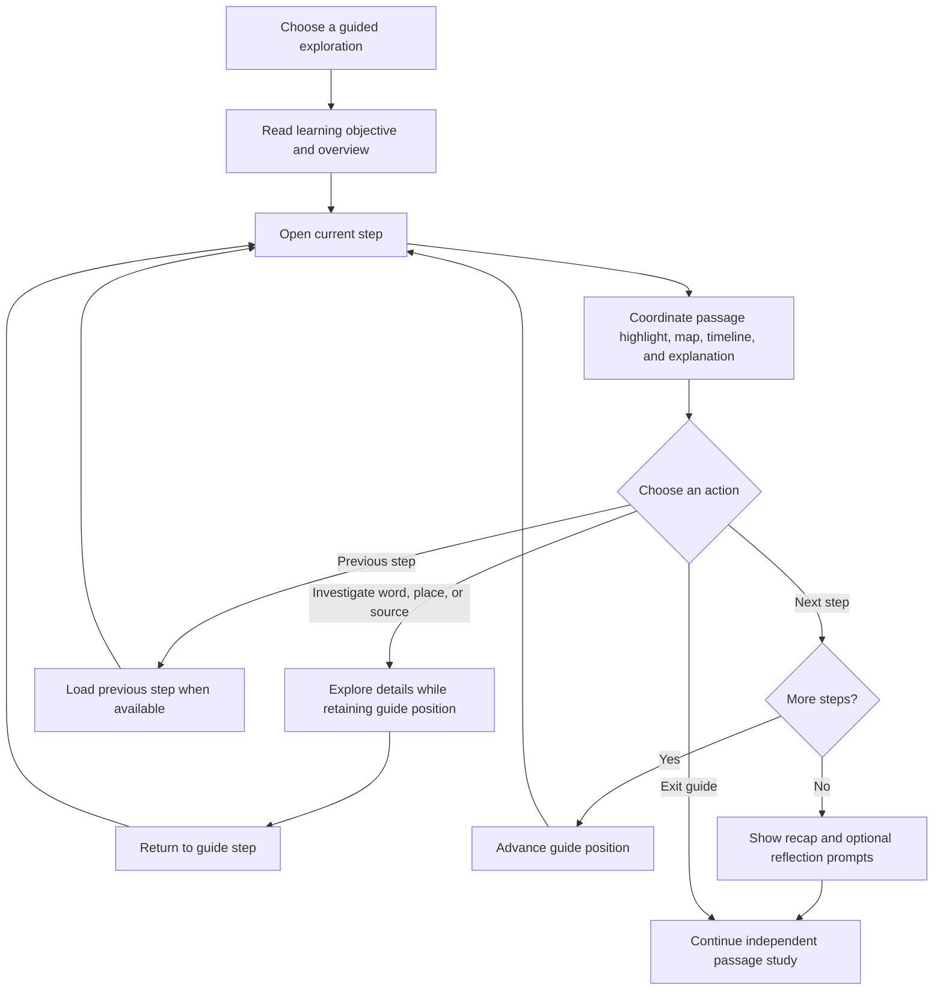
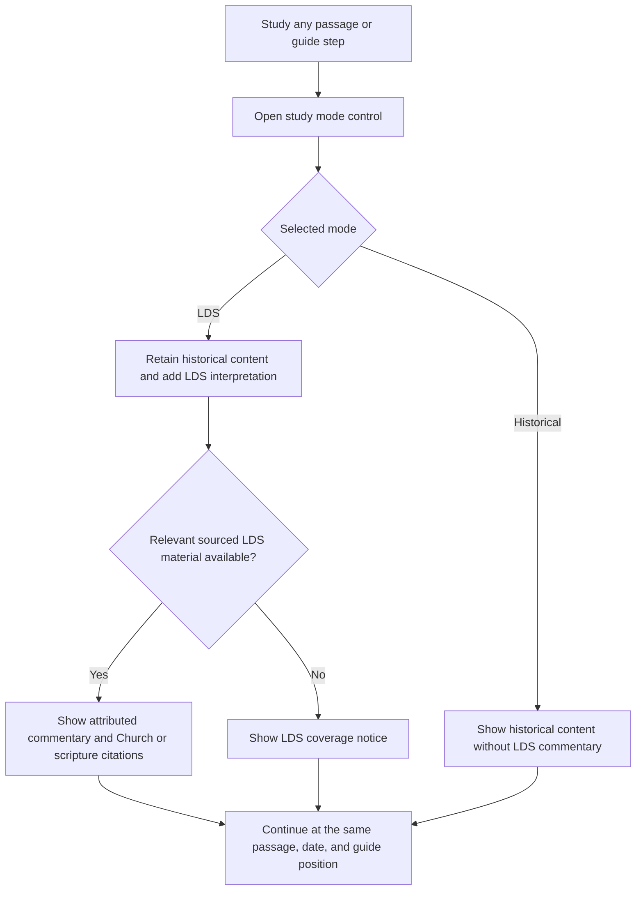
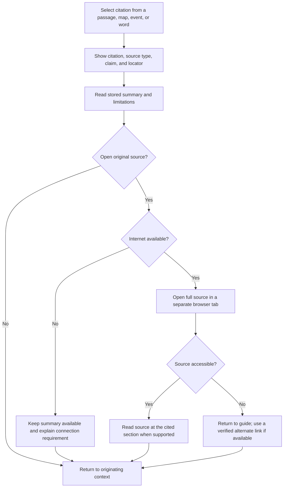
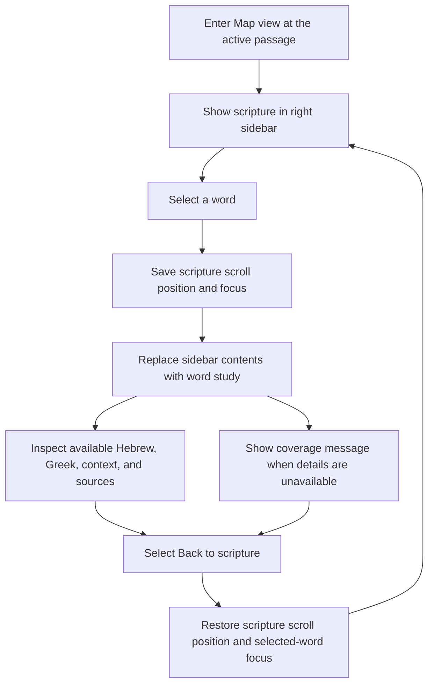
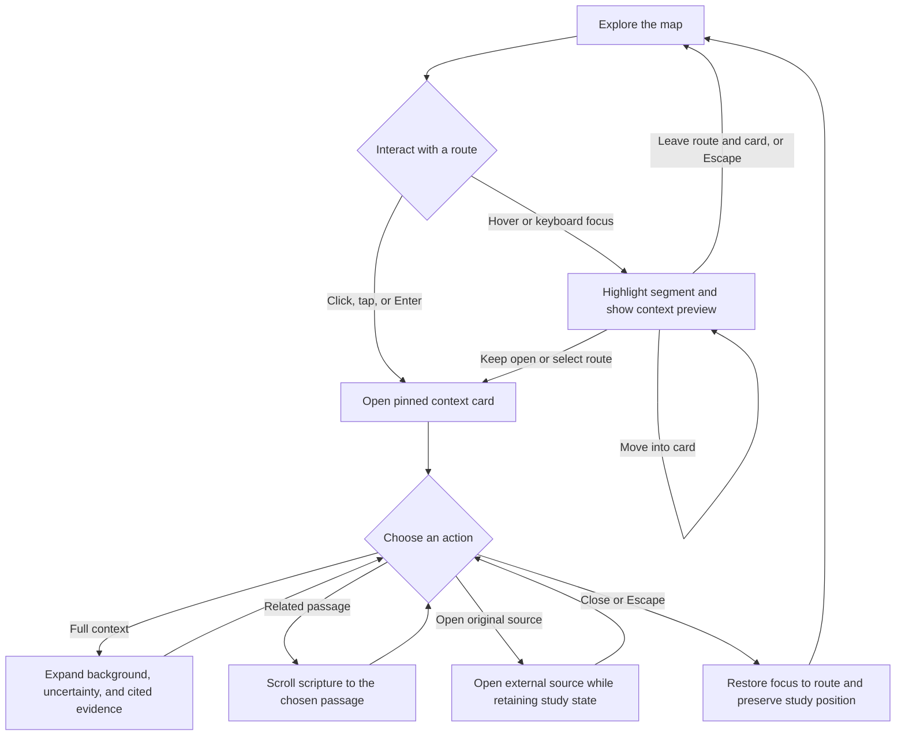

# Meridian — Isaiah Study Guide Product Requirements

Version: 0.4 · September 20, 2026 · Planning draft

## 1. Purpose and audience

Create a visually rich, locally hosted Isaiah study guide for an academically experienced reader who is comfortable reading published research but wants accessible explanations. Connect passages to geography, political developments, historical evidence, original languages, and optional faithful Latter-day Saint interpretation.

Success means the reader can explain a passage's historical setting, explore the evidence, understand important language choices, and distinguish historical reconstruction from religious interpretation.

## 2. Confirmed decisions

- Two experiences: secular historical study and faithful LDS study built on the same historical foundation.
- The timeline concerns historical settings represented in the book; composition dates are supplementary context.
- Use a legally reusable Bible translation. NRSV is preferred if permission becomes practical; alternatives are acceptable.
- Include Hebrew, Septuagint Greek, and relevant later Greek uses of Isaiah.
- Begin with a focused pilot.
- Use freely accessible scholarship and other credible public resources. Do not make paywalled material required reading.
- Support guided learning and independent exploration.
- Run locally first, with a possible public website later.
- Unified Meridian branding: dark navy and blue surfaces across Read and Map views, with illustrated landscapes in Read view.
- Map view's right sidebar shows scripture by default. Selecting a word replaces that sidebar with word study; a back arrow restores the scripture at the same position.

Choices labeled proposed below are recommendations, not additional user commitments.

## 3. Two study experiences

**Proposed implementation:** One application with persistent Historical and LDS study modes, separate entry links, and shared content underneath. Switching modes preserves the selected passage, map position, and timeline state. Separate deployments remain possible later.

### Historical mode

Present geography, political history, archaeology, literary context, textual evidence, and scholarly interpretations. Describe supernatural claims as claims of the text or its interpreters; do not adjudicate them through historical evidence alone. Explain scholarly disagreements and the limits of available evidence. Religious interpretation is not part of this mode's explanatory voice.

### LDS mode

Retain the full historical foundation and add faithful interpretation, relevant Restoration scripture, official Church resources, and general conference talks. Identify the speaker or author, resource type, date, and exact passage supporting each explanation.

Distinguish scripture, statements in talks, teaching manuals, and the guide's own synthesis. Do not imply that every statement in a Church-hosted resource has the same doctrinal status. Present differences between historical scholarship and faithful interpretations respectfully; do not manufacture agreement or let mode selection silently change historical evidence.

**Proposed default:** Official Church resources supply the pilot's LDS commentary. Independently published LDS scholarship can be added later with separate labels. Include relevant Book of Mormon and other Restoration connections when supported, without forcing a connection for every passage.

## 4. Proposed pilot

Cover Isaiah 36–39: a contained sequence that can exercise political geography, the Assyrian threat, Hezekiah's story, and the transition toward Babylonian concerns. The Church's chapter guide also identifies this transition and the parallel account in 2 Kings [3]. External evidence can be introduced through Assyrian inscriptions and museum resources [4–6]. These sources must be compared critically rather than treated as automatic corroboration of every narrative detail.

Provide full reading coverage for these four chapters. Other chapters may appear in navigation as unavailable; do not imply complete coverage.

Proposed content budget, adjustable after source review:

- 6–8 passage-level context entries.
- 3 short guided explorations: the Assyrian crisis; comparing biblical and Assyrian accounts; Babylon and the passage's later historical horizon.
- 12–18 sourced timeline events and 12–20 mapped places or regions.
- At least 20 substantial word studies, with basic language information for other mapped words where suitable datasets permit.
- Approximately 8–12 freely readable historical/scholarly sources plus relevant official LDS resources. This is a target, not a substitute for claim-level coverage.

All four chapters receive context notes; chapters 38–39 must not inherit chapter 36's date simply because they occur later in reading order.

## 5. Reader and visual workspace

Use one Meridian identity across two layouts selected with a Read / Map control. This layout control is independent of the Historical / LDS perspective control. Both layouts use dark navy backgrounds, layered blue panels, pale readable text, and restrained cyan selection accents. Use consistent typography, navigation, and controls throughout; do not switch to cream or parchment panels in Read view.

**Read view:** Present spacious scripture text with Waymark-inspired illustrated landscapes in a complementary blue palette. Keep illustrations separate from the solid reading surface and label reconstructions. Provide a contextual study sidebar for selected words, commentary, and sources. Retain a compact timeline and an action to open the passage in Map view.

**Map view:** Give the map most of the workspace, with a prominent timeline docked beneath it and scripture in the right sidebar by default. The scripture sidebar supports chapter navigation, verse numbers, scrolling, and text selection. Selecting a word replaces the contents of this same sidebar with its word study, including Hebrew, Greek, contextual explanation, and sources where available. Show a clearly labeled back arrow, Back to scripture, at the top. Back restores the chapter, verse, scroll position, and keyboard focus to the selected word. Do not open a second sidebar or cover the map with a word-study modal. Missing word information also retains the back action.

The map viewport, selected date, overlays, and navigation state remain unchanged while entering or leaving word study; a related place may be highlighted without automatically moving the map. Collapsing the sidebar expands the map, and reopening it restores its prior contents. Entering Map view from Read view shows scripture at the active passage, retaining any word highlight so the reader can reopen its study. On smaller screens, use linked views that preserve the same state and back behavior.

Selecting a passage updates relevant places, events, and contextual explanation. Chapters containing different settings offer passage-specific choices. Selecting a map feature highlights related verses and opens its evidence in a map-anchored context card, preserving the scripture sidebar. Word selection opens details without navigating away. Remove the persistent "Select a word to explore" footer and its divider from the scripture sidebar; use that space for reading.

Offer two navigation states: Follow passage and Explore history. Scrubbing away from the passage's setting enters Explore history and provides a clear Return to passage action. Never silently reassign the passage to the scrubbed date.

Use layered explanations: a short orientation, an expanded account, and source-level detail. Explain unfamiliar technical terms inline. Include keyboard navigation, readable original scripts, non-color indicators, reduced-motion behavior, and a text equivalent for map information.

## 6. Historical map and timeline

Map layers include relevant cities, regions, political control or influence, and documented campaigns or displacement where supported. Separate direct control from tributary relationships and influence. Use approximate areas and schematic routes when evidence cannot justify precise boundaries or movements; explain this in the legend.

Every historical overlay needs a source, applicable date or range, and an uncertainty note. Do not interpolate convincing-looking annual borders between sparse historical snapshots. Terrain may remain stable while historical overlays change.

### Map navigation and historical flyouts

Hovering over a campaign trail highlights the relevant segment and opens a compact, map-anchored historical context card. Proposed behavior: a brief hover delay prevents incidental popups while moving across the map. Moving from the route into the card keeps it open so its links and controls can be used. Leaving both dismisses an unpinned card after a short grace period. Escape dismisses the card and suppresses immediate reopening until a new hover or focus interaction.

The preview includes the campaign or segment title, supported date or range, involved powers, a two- or three-sentence historical explanation, related passage links, and a visible route-uncertainty label. Distinguish evidence for the campaign from evidence for the path drawn. Use "Schematic route" where the line communicates a narrative connection rather than a reconstructed march. Segment-specific evidence must not imply that all parts of a campaign are equally documented.

Clicking a route or choosing Keep open pins the card; a touch tap or keyboard Enter opens it directly in this stable state. Pinned cards remain until explicitly closed or another feature is selected. A Full context action expands the same card with historical background, evidence, competing interpretations where applicable, and cited source links. A Related passage action intentionally scrolls the scripture sidebar to that passage; hovering alone never scrolls scripture or changes the selected date. Preview and expanded card content obey the Historical / LDS perspective selection and retain source-type labels.

Keep only one map context card open at a time. Place it beside the selected feature, repositioning within map bounds to avoid the sidebar and timeline. Map context must not replace scripture or its word-study state. Source inspection stays within the context card until the reader opens an original source in a separate tab. Closing the card restores focus to its originating feature and leaves map, timeline, and scripture positions unchanged.

Support equivalent interactions for place markers, influence regions, and timeline event markers with content appropriate to each feature. Give thin route lines a generous invisible interaction area and distinguish overlapping routes with a short chooser. Provide an accessible feature list for keyboard and touch users. On narrow screens, open context in a dismissible bottom sheet without losing scripture state.

Pan and zoom remain independent of passage selection. Dismiss transient previews when dragging or zooming; keep a pinned card stable with an offscreen-location indicator if its anchor moves out of view. Scrubbing the timeline or hiding a layer dismisses cards for features no longer visible, with no silent date change. Respect reduced-motion preferences and use line weight or outline as well as color for selection. The next prototype should validate card placement, hover delay, route hit areas, and the clarity of pinned versus transient states.

Keep the requested labels Pre-Isaiah, Isaiah, and Post-Isaiah, with subtitles defining them as antecedents, core historical setting, and aftermath for the selected study sequence. Explain that these are navigation periods, not claims about authorship or composition. Exact boundaries and the pilot's total time range remain an editorial research task; include only events needed to explain the selected passages and their aftermath.

Provide event snapping, readable date ranges, and a visible current date. Preserve chronological order even where passage order differs. Distinguish the setting of the narrative, events referenced or anticipated by the text, and proposed composition dates. Put later reception, including modern Church talks, in a separate panel so it does not stretch the ancient geopolitical timeline.

## 7. Word and textual exploration

Every displayed word can be selected, including a clear explanation when detailed information is unavailable. Punctuation does not require its own entry.

Where supported, show the associated Hebrew token or phrase, lemma, transliteration, morphology with a plain-language explanation, contextual meaning, and alternative interpretations. Identify the underlying text edition and dataset.

Show Septuagint Greek with its own lemma, transliteration, contextual gloss, and noteworthy differences from the Hebrew. Include relevant New Testament quotations or allusions, labeling direct quotation, possible allusion, and broader thematic association distinctly. Identify later interpretation separately from the word's contextual meaning in Isaiah.

Model word alignment as many-to-many: one English word may correspond to a phrase or no explicit source-language token. Preserve verse-numbering differences between editions. Do not present automated alignment as verified or assume Greek is an interchangeable original for the Hebrew.

The pilot's detailed annotations are curated from sources. Basic dictionary senses must not masquerade as passage-specific scholarly conclusions. Exhaustive coverage of Hebrew variants, Greek variants, and later reception belongs to later expansion.

## 8. Research and editorial requirements

Use open-access articles, publicly accessible scholarly editions, institutional repositories, museum records, and credible expert reference material. Distinguish primary evidence, academic research, expert overview, and faith commentary. Age, credentials, publication context, and relevance matter; free availability alone is insufficient.

Each research summary records its main claim, supporting evidence, limitations, relevant verses, full citation, and a working full-text link. Cite the source actually read; do not summarize inaccessible papers from titles or abstracts as though the full work was available. Look for open author manuscripts where publisher versions are paywalled.

Disputed conclusions show competing explanations and why they differ. Avoid unsupported labels such as scholarly consensus. AI-assisted drafting is permitted as a proposed workflow, but each published claim must be checked against the cited text. Record verification status honestly; do not claim specialist review without a specialist reviewer.

Maintain a content registry linking passages, events, places, map overlays, words, sources, and LDS commentary. Each record stores source locators, date uncertainty where relevant, attribution/reuse terms, and review status. Missing content should be visible rather than filled with invented explanations.

## 9. Text and reuse plan

**Proposed launch text:** World English Bible, whose publisher explicitly places the text in the public domain [1]. Offer KJV comparison only after selecting and checking the particular reusable source edition and any included annotations.

Keep translation support modular. Friendship Press currently states that the NRSV, except NRSV-CE, is unavailable for new licensing and that software uses require special permission or licensing [2]. Treat NRSVue as a potential future licensed option; local hosting is not the permission basis.

Record reuse terms separately for Bible texts, Hebrew/Greek datasets, translations of inscriptions, map data, artifact images, research excerpts, and Church material. Public access does not establish permission to redistribute an entire resource. Prefer original summaries and links, using quotations and stored assets within their applicable permissions. Historical reconstructions and illustrative imagery must be clearly labeled.

## 10. Local operation and scope boundaries

Proposed: a browser-based application served locally, with curated content stored alongside it. No account, paid API, or remote database is required for normal study. Store reading position and preferred mode locally. Bundle permitted core text, notes, and map assets so the basic pilot can function without internet after setup; opening original sources requires connectivity.

Design for later web deployment, but do not publish in this phase. Personal notes, exports, full-book coverage, live AI chat, community features, exhaustive language commentary, and separate mobile apps are deferred.

## 11. Pilot acceptance criteria

- All pilot chapters are readable; each curated passage has a linked historical explanation and a meaningful map/timeline state, or an explicit reason no precise state applies.
- Selecting a passage, event, place, or word keeps the reader's position intact. Returning from exploration restores passage context.
- Both Read and Map use the unified dark blue Meridian design. Map opens with scripture in its sidebar; selecting a word replaces that sidebar, and Back to scripture restores the exact reading position and focus without resetting map or timeline state.
- Switching study modes preserves navigation. Historical mode excludes LDS interpretive commentary; LDS mode includes the same historical evidence plus clearly attributed faithful commentary.
- Every substantive historical claim, map overlay, and detailed word-study interpretation has supporting citations and any relevant uncertainty label.
- Every recommended research reading is accessible in full without a subscription at verification time.
- All selected words provide useful information or an honest coverage message. No unsupported one-to-one original-language mapping is shown.
- Dates, routes, borders, and disputed reconstructions are visibly qualified where needed.
- Campaign routes expose the same sourced context through hover, keyboard, and touch. Readers can move into a flyout, pin it, inspect evidence, and dismiss it without losing scripture position. Map flyouts do not replace the scripture sidebar. The sidebar has no persistent "Select a word to explore" footer.
- Core study works locally without an account; keyboard navigation and a small-screen layout remain usable.
- In a walkthrough, the user can explain the main powers and places, identify one uncertainty, compare evidence from two source types, inspect a Hebrew/Greek entry, and find an LDS citation without losing their place.

## 12. Remaining implementation decisions

These do not block the PRD. Proposed defaults can be revised during the prototype:

1. One application with two study modes, rather than two independent applications.
2. Isaiah 36–39 as the pilot, with the final time range set through source research.
3. World English Bible initially; translation expansion remains possible.
4. Official Church sources for LDS interpretation in the pilot, with independently published LDS scholarship deferred.
5. Desktop-first local experience with permitted core content available offline.

Before implementation, validate original-language dataset licenses and alignment quality, source the timeline boundaries, and test a single passage end to end. Build the remaining pilot content only after that complete interaction is satisfactory.

## 13. User flow charts

These flows describe the proposed pilot experience. Charts use Mermaid notation. The selected passage, reading position, study mode, and map/timeline exploration state persist while opening and closing detail panels.

### 13.1. Start or resume passage study

Readers can resume their last session, enter through a passage link, or select a pilot chapter. Historical context is assigned at passage level.

### 13.2. Explore the geopolitical map and timeline

The scrubber includes the defined Pre-Isaiah, Isaiah, and Post-Isaiah periods. Exploring another date does not change the selected passage or imply a new date for it.

Closing a feature panel preserves the current date and navigation state; it does not itself enter Explore history. A related passage outside pilot coverage shows the coverage notice and leaves the current passage intact.

### 13.3. Inspect a word and its textual connections

Original-language information is presented only where supported. The interface distinguishes verified alignments, uncertain mappings, and missing coverage. In Map view this flow takes place inside the scripture sidebar: word details replace the scripture, and Back to scripture restores its previous scroll position and focus. In Read view the main scripture remains visible alongside word details.

Unavailable Greek or later-use material receives a coverage message. Absence of an annotation is not presented as evidence that no textual relationship exists.

### 13.4. Follow a guided exploration

Guides combine short explanations with passage highlights, map changes, and timeline events. Readers may leave the sequence to investigate evidence and then return to the same step.

### 13.5. Switch between Historical and LDS study

Mode selection changes the interpretive material available while preserving the same historical evidence and navigation state.

If a mode switch removes the currently open commentary panel, return focus to its passage or guide step. Historical mode remains readable as a complete experience.

### 13.6. Read research and verify a claim

The same source flow supports historical research, word-study references, and LDS citations, with source types visibly distinguished.

External source access does not reset study state. Do not imply the local application can automatically detect a paywall or failure in another browser tab; provide a source-problem reporting action in the citation panel.

### 13.7. Map scripture sidebar and word-study return

Keep map position, timeline date, and enabled layers intact throughout this flow. Sidebar navigation must not silently return an independently explored date to the passage's date.

### 13.8. Campaign trail exploration

Hover never changes the passage, scripture scroll position, or timeline date. Selecting a related passage is an explicit reading action; selecting a word within scripture continues to use the sidebar flow in section 13.7.

## Source checks and starting resources

These establish initial feasibility and research leads; they are not a completed pilot bibliography. Accessed September 20, 2026.

1. [World English Bible — copyright declaration](https://ebible.org/engwebp/copyright.htm).
2. [Friendship Press — licensing and permission guidelines](https://www.friendshippress.org/pages/nrsvue-quick-faq).
3. [Church of Jesus Christ — Isaiah 36–39, Old Testament Seminary Teacher Resource Manual](https://www.churchofjesuschrist.org/study/manual/old-testament-seminary-teacher-resource-manual/the-book-of-isaiah/isaiah-36-39?lang=eng).
4. [ORACC/RINAP — Sennacherib inscription with Hezekiah passage](https://oracc.museum.upenn.edu/rinap/rinap3/Q003945).
5. [British Museum — Lachish relief collection record](https://www.britishmuseum.org/collection/object/W_1856-0909-14_2).
6. [British Museum research repository — A Researcher's Guide to the Lachish Collection](https://britishmuseum.iro.bl.uk/entities/publication/9b64b0c6-4d6e-4b08-9b15-b60c77e1d8fc).
